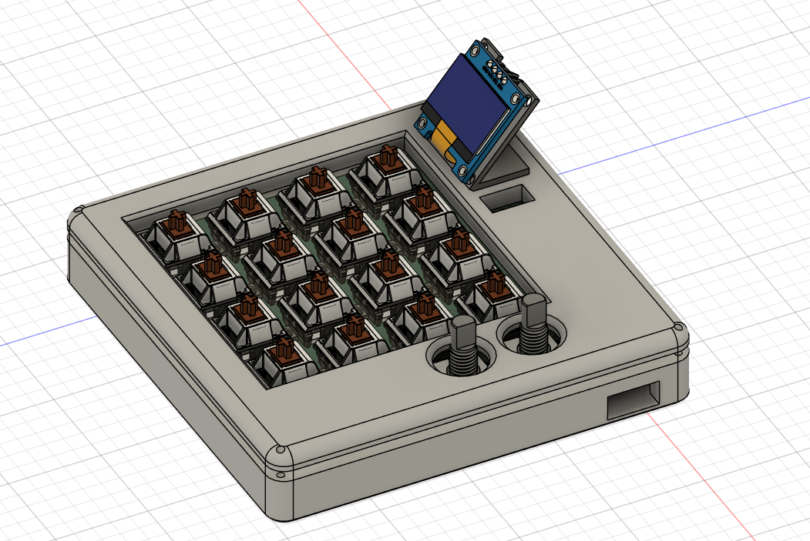

# HackPad
## My experience
As part of **Hack Club’s HACKPAD YSWS** program, I embarked on a rewarding journey to build my own DIY macropad. This experience allowed me to explore various technical disciplines, from designing a custom **PCB in KiCAD** to **coding my very own firmware with QMK**. The most challenging aspect of the project was undoubtedly the PCB design. It required extensive research into component specifications, navigating datasheets, and ensuring that each part—switches, diodes, microcontrollers—was properly integrated into the design. The process of **placing components and routing the traces** was the most time-consuming and working through these challenges gave me a much deeper understanding of electronics design.

On the other hand, the part I enjoyed the most was **working with CAD**. With my existing CAD skills, I was able to confidently create a functional layout for the macropad’s physical structure. Translating these skills into real-world applications for a product I could use was fulfilling and rewarding. Coding the firmware was surprisingly straightforward, thanks to QMK's user-friendly environment, making the software side of things much simpler than anticipated. 
***Overall, this project was an invaluable learning experience that not only introduced me to PCB design but also allowed me to merge my existing skills with new knowledge to create something functional.***
## Bill Of Materials

    Xiao RP2040
    PCF8574 IO expander
    SSD1306 0.96 OLED
    (2) 4.7k resistor
    (16) SK6812 LED
    (16) 1N4148 diodes
    (16) Cherry MX brown switches

    (16) any keycaps at hq
    (16) Mill-Max 0305s hotswap socket
    (2) any encoder knobs at hq
    (2) EC11 encoder
    
    **--> Please laser cut the plate in 3mm clear acrylic and 3D print the rest of the pieces.**

### My Model

### My schematic

