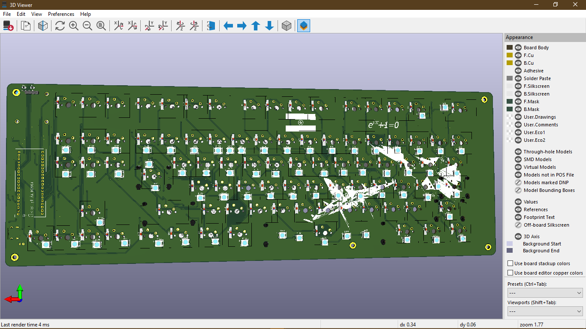

Below is an example Bill of Materials (BOM) for Soup_pad 88‐key keyboard build. This BOM lists the main electronic components, mechanical parts (switches, keycaps, stabilizers), and other necessary hardware
---

### Bill of Materials (BOM)

#### 1. Display
- **Component:** SSD1306 OLED Display  
- **Size:** 0.96″ (typically 128×64 pixels)  
- **Interface:** I2C  
- **Notes:** Use a black-fronted module if aesthetics matter.

#### 2. Switches
- **Component:** Cherry MX Mechanical Switches  
- **Quantity:** 88 pcs  
- **Type:** (Specify your preferred variant, e.g. Cherry MX Brown, Red, Blue, etc.)

#### 3. Keycaps & Layout Details
The keycap sizes below are derived from the provided JSON layout (ANSI style):

- **Row 1 (Function Row):**  
  - All keys (Esc, F1–F12, PrtSc, Scroll Lock, Pause Break): **1u**

- **Row 2 (Number Row):**  
  - ~\` and number/symbol keys: **1u** each  
  - **Backspace:** Typically a **2u** key  
  - Insert, Home, PgUp: **1u** each

- **Row 3 (Q – ] Row):**  
  - **Tab:** **1.5u**  
  - Q, W, E, R, T, Y, U, I, O, P, {, } : **1u** each  
  - The key between the bracket keys and Enter (described by a composite object) is generally a **2.25u** key (often the backslash/pipe key)  
  - **Enter:** **2.25u** (may be L-shaped/split as shown)

- **Row 4 (A – ' Row):**  
  - **Caps Lock:** **1.75u**  
  - A–L, ;, ' : **1u** each

- **Row 5 (Z – / Row):**  
  - **Left Shift:** **2.25u**  
  - Z, X, C, V, B, N, M, <, >, ? : **1u** each  
  - **Right Shift:** **2.75u**  
  - Additional key (↑): **1u**

- **Row 6 (Bottom/Modifier Row):**  
  - **Ctrl:** **1.25u**  
  - **Win (Command):** **1.25u**  
  - **Alt:** **1.25u**  
  - **Spacebar:** **6.25u** (see note on stabilizers)  
  - (A gap or additional key of **1.25u** is indicated between spacebar and right-hand keys)  
  - Additional keys (Alt, Win, Menu, Ctrl): **1.25u** each  
  - Arrow keys (←, ↓, →): **1u** each

*Note:* Many custom keyboards use keycap sets sold by unit size (e.g. 1u, 1.25u, 1.5u, etc.). Verify that your keycap set includes all these sizes.

#### 4. Stabilizers
For a smooth and rattles-free experience, larger keys (generally >1.5u) should be stabilized. Typical candidates:
- **Backspace:** (2u) – 1 pair
- **Enter:** (2.25u) – 1 pair  
  *If using an L-shaped/split enter, check your stabilizer design or kit.*
- **Left Shift:** (2.25u) – 1 pair
- **Right Shift:** (2.75u) – 1 pair
- **Spacebar:** (6.25u) – Usually 2 or 3 stabilizers (depending on design; common is to use a set of plate-mount stabilizers)

*Tip:* Many kits offer “stabilizer sets” that include several pairs; ensure the set covers all oversized keys in your layout.

#### 5. Passive Components
- **Resistors:**
  - 2 × 4.7kΩ (0805 package)
  - 2 × 5.1kΩ (0805 package)
- **LEDs:**
  - 2 × Green LED (0805 package)

#### 6. Connectors & Other Hardware
- **Connector:** USB-C Female Connector (for power/data)
- **PCB:**  
  - Name: **Soup_pad**  
  - Color: **Black**
- **Case:**  
  - Material/Finish: **Black** (to match PCB aesthetics)

#### 7. Additional Considerations
- **Diodes:** Ensure you have appropriate diodes (e.g., 1N4148 or similar) for each switch if your PCB does not include them.
- **Microcontroller:** The PCB likely accommodates a microcontroller (running KMK firmware); verify that it is included or purchase separately.
- **Miscellaneous:** Solder, wires, standoffs, and assembly tools.
- assembly

- Schematic

- pcb top

- my branding with isro lockheed martin and meth and more 

- pcb bot 

---
