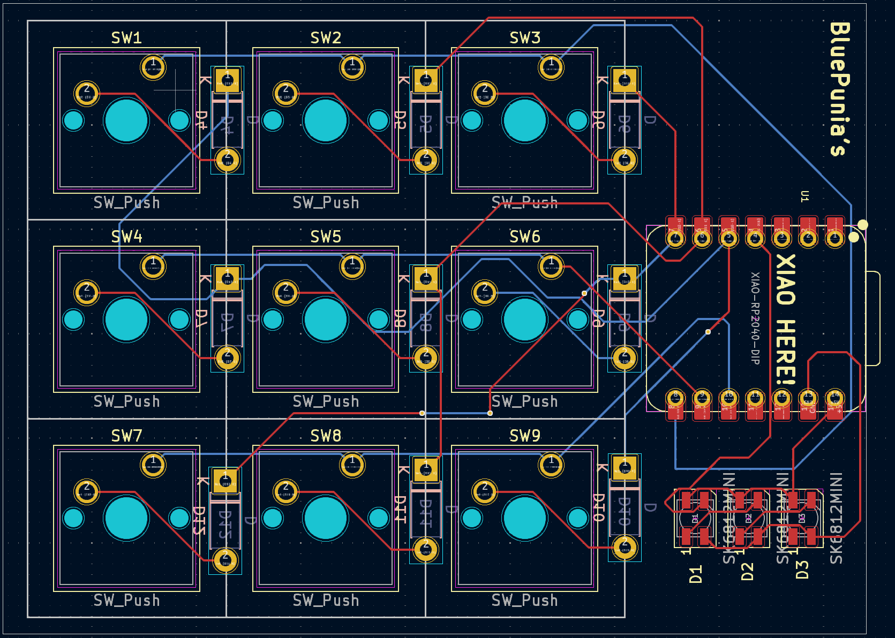
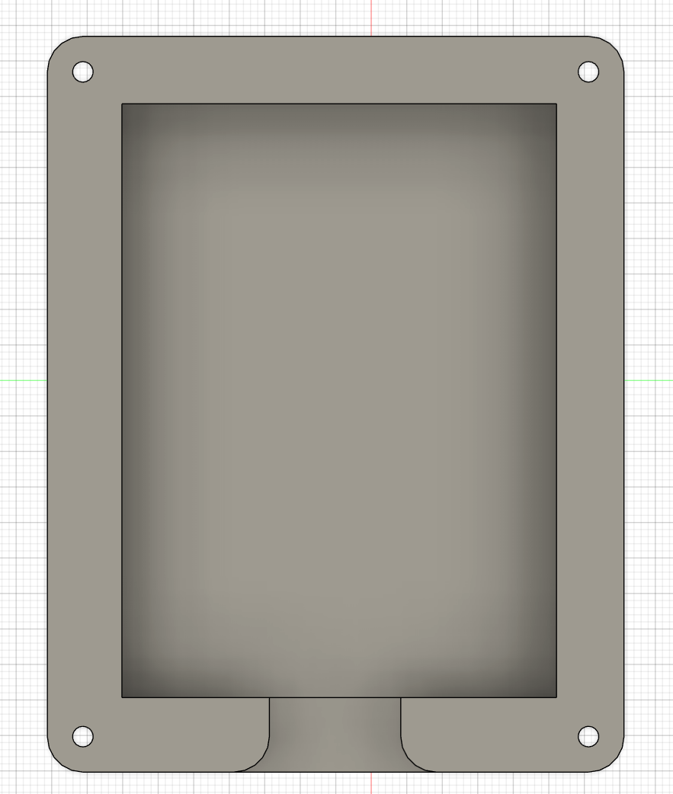

## BluePunia's hackpad 
# INSPIRATION
I wanted to create something PCB-related for the first time in my life - wanted to learn something new. 

I created a rather simple design, yet it was challenging for me cause I've never used KiCad or Fusion 360 before. 
Design:

# Schematic:

# PCB:

# Case:

(It's branded on the very bottom)

# BOM:
9x Cherry MX Switches
9x DSA keycaps (white if possible)
4x M3x16mm bolts 
3x 1N4148 diodes
1x XIAO RP2040
1x case (2 printed parts)
1x custom PCB

# Others:
The macropad is designed to have 3 layers, so basically instead of 9 binds I have 27. The user knows on which layer he is by looking at the RGB diodes, each one of them turned on tells the user on which layer he's on. It's a great device for assigning hotkeys - useful for programmers, gamers or streamers (and for me - someone who uses PC all the time).

(I'm sorry for my fussion360 skills, I tried my best with the clock ticking :3)

